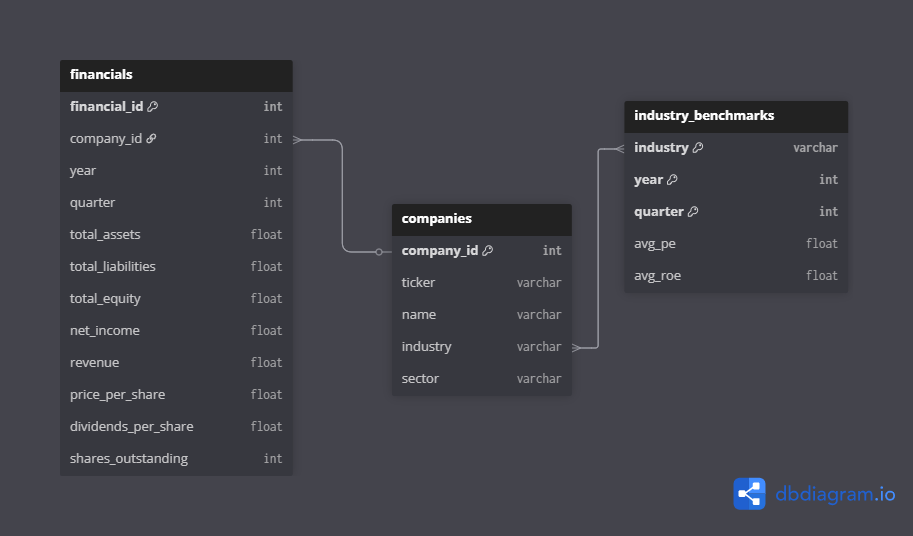

# SQL Recommender

A SQL-driven ranking system that scores Philippine stocks using basic fundamentals such as profitability, valuation, and leverage.

---

## Project Summary

This project builds a **pure-SQL engine** that computes financial ratios, ranks companies within their industries, and generates Buy/Hold/Sell recommendations.

The mock dataset contains quarterly financial data for Philippine stocks, combining:

- **Companies** — tickers, names, sectors, industries  
- **Financials** — quarterly statements per company  
- **Industry Benchmarks** — quarterly reference values per industry  

The project demonstrates the ability to:

1. **Load data** — take CSV files and write them to database tables  
2. **Clean messy data** — handle typos, nulls, and inconsistent formats  
3. **Analyze data** — perform ranking, aggregation, and windowed calculations using SQL  
4. **Use views** — maintain modular, readable, and reproducible workflows  
5. **Communicate visually** — turn raw SQL output into clear, data-driven insights  

---

## Tools

- **SQL** — Core logic for cleaning, transformation, and analytics  
- **PostgreSQL** — Database engine  
- **Jupyter Notebook** — Documentation and SQL narration  
- **Python** — For loading CSVs into the database  

---

## Environment Setup

The project uses an environment file (`.env`) to store database credentials.  
Example contents:

    DB_SERVER=localhost
    DB_PORT=5432
    DB_NAME=fundamentals
    DB_USER=<your_username>
    DB_PASSWORD=<your_password>

---

## Data Notice

All data used in this project is **synthetic** and was generated solely for demonstration and learning purposes.  No real financial or market data was used.

---

## Repository Structure

    sql-recommender/
    │
    ├── data/                # CSV files
    │
    ├── notebooks/
    │   ├── 0_setup.ipynb
    │   ├── 1_load_data.ipynb
    │   ├── 2_cleaning.ipynb
    │   └── 3_analysis_ranking.ipynb
    │
    ├── assets/              # screenshots and schema diagrams
    └── README.md

---

## Portfolio Positioning

This project is part of a four-piece portfolio that showcases range and depth as a data analyst:

- **SQL Recommender Dashboard** → Fundamentals ranking dashboard (analytical SQL + structured reasoning)  
- **EV Dashboard** → Climate storytelling (business insight + visualization)  
- **STARZZ Dashboard** → Statistics-heavy science analysis (data cleaning + stats)  
- **Curly Memory** → Python finance tracker (discipline + automation)  

Together, these projects demonstrate proficiency in **data wrangling, analytical SQL, statistical reasoning, and clear data storytelling**.
